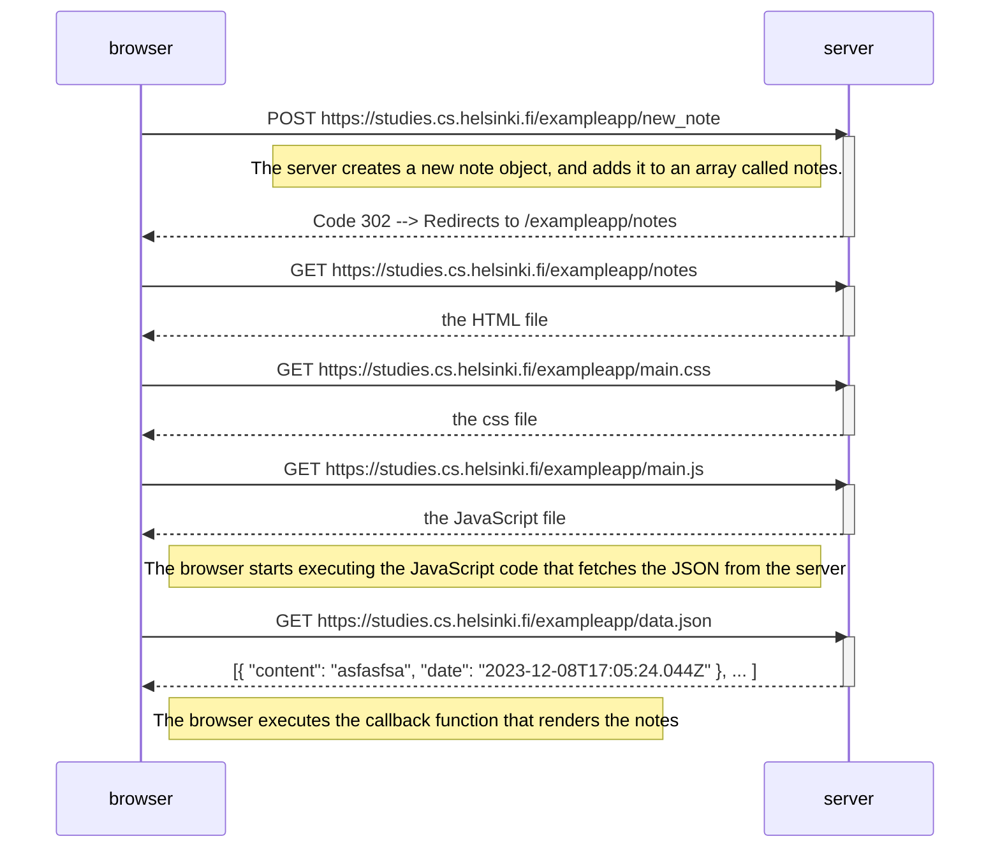
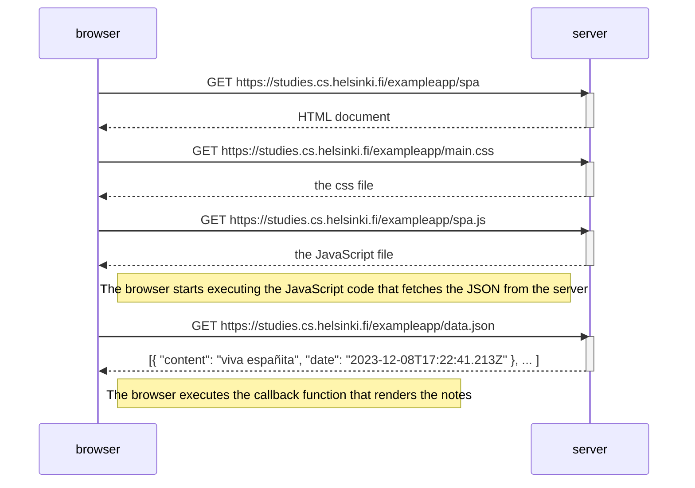
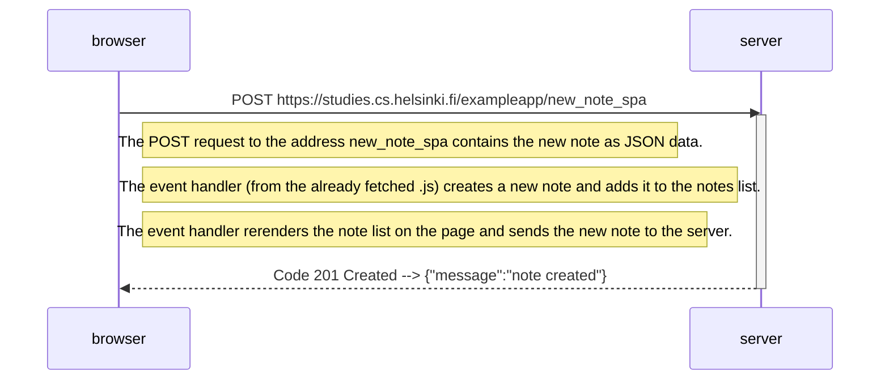

# 0.4: New note diagram

```mermaid

sequenceDiagram
    participant browser
    participant server

    browser->>server: POST https://studies.cs.helsinki.fi/exampleapp/new_note
    activate server
    
    Note left of server: The server creates a new note object, and adds it to an array called notes.

    server-->>browser: Code 302 --> Redirects to /exampleapp/notes
    deactivate server

    browser->>server: GET https://studies.cs.helsinki.fi/exampleapp/notes
    activate server
    server-->>browser: the HTML file
    deactivate server

    browser->>server: GET https://studies.cs.helsinki.fi/exampleapp/main.css
    activate server
    server-->>browser: the css file
    deactivate server

    browser->>server: GET https://studies.cs.helsinki.fi/exampleapp/main.js
    activate server
    server-->>browser: the JavaScript file
    deactivate server

    Note right of browser: The browser starts executing the JavaScript code that fetches the JSON from the server

    browser->>server: GET https://studies.cs.helsinki.fi/exampleapp/data.json
    activate server
    server-->>browser: [{ "content": "asfasfsa", "date": "2023-12-08T17:05:24.044Z" }, ... ]
    deactivate server

    Note right of browser: The browser executes the callback function that renders the notes

```
 
 

# 0.5: Single page app diagram

```mermaid

sequenceDiagram
    participant browser
    participant server

    browser->>server: GET https://studies.cs.helsinki.fi/exampleapp/spa
    activate server
    server-->>browser: HTML document
    deactivate server

    browser->>server: GET https://studies.cs.helsinki.fi/exampleapp/main.css
    activate server
    server-->>browser: the css file
    deactivate server

    browser->>server: GET https://studies.cs.helsinki.fi/exampleapp/spa.js
    activate server
    server-->>browser: the JavaScript file
    deactivate server

    Note right of browser: The browser starts executing the JavaScript code that fetches the JSON from the server

    browser->>server: GET https://studies.cs.helsinki.fi/exampleapp/data.json
    activate server
    server-->>browser: [{ "content": "viva españita", "date": "2023-12-08T17:22:41.213Z" }, ... ]
    deactivate server

    Note right of browser: The browser executes the callback function that renders the notes

```
 
 

# 0.6: New note in Single page app diagram

```mermaid

sequenceDiagram
    participant browser
    participant server

    browser->>server: POST https://studies.cs.helsinki.fi/exampleapp/new_note_spa
    activate server
    
    Note right of browser: The POST request to the address new_note_spa contains the new note as JSON data.
    
    Note right of browser: The event handler (from the already fetched .js) creates a new note and adds it to the notes list.
    
    Note right of browser: The event handler rerenders the note list on the page and sends the new note to the server.
    
    server-->>browser: Code 201 Created --> {"message":"note created"}
    deactivate server


```